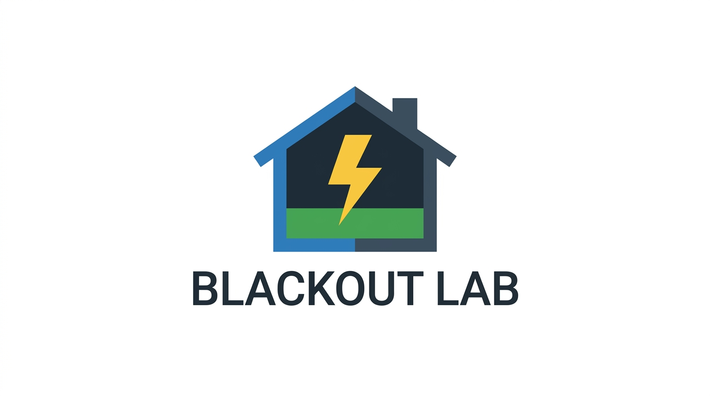

# ⚡️ Blackout Lab – Online-Escape-Game zur Energiewende



> 🎮 Ein kooperatives Browser-Spiel für den Unterricht – inspiriert von Escape-Games rund um Stromausfall, Energiewende und die All Electric Society.

Story:
https://gemini.google.com/share/97996859cb2d
---

## 🧠 Was ist Blackout Lab?

**Blackout Lab** ist ein leichtgewichtiges Online-Escape-Game für den Einsatz im Unterricht (ab Klasse 8).
In sechs aufeinander aufbauenden Levels lösen Lernende Rätsel rund um Stromausfall, Energiespeicher,
Haushaltsverbrauch und Solartechnik – komplett im Browser, ohne Login und ohne Backend.

---

## 🌟 Features auf einen Blick

- 🏠 **6 Level** ("Häuser") zu den Themen Stromausfall, Energiebedarf, Speicher & Solar
- 🌐 **100 % clientseitig** – reines HTML, CSS & JavaScript, ideal für Schulnetze
- 👨‍🏫 **Unterrichtsfreundlich**: Texte & Lösungen zentral in `js/game.js` anpassbar
- 🤝 **Kooperativ**: bestens geeignet für Gruppenarbeit (3–6 SuS pro Gerät)
- 📱 **Responsive**: läuft auf PCs, Tablets und großen Smartphones

---

## 🏗 Projektstruktur

```text
.
├─ index.html      # Einstieg ins Spiel
├─ css/
│  └─ styles.css   # Layout und Haus-Design
├─ js/
│  └─ game.js      # Spiel-Logik und Rätseldefinitionen
└─ assets/
   ├─ logo.png     # Logo für Kopfzeile / README
   └─ icons/       # optionale Zusatzgrafiken
```

---

## 🚀 Schnellstart

### 🔹 Variante 1: Direkt lokal öffnen

1. Repo herunterladen oder klonen.
2. `index.html` im Browser öffnen.

> ✅ Perfekt zum schnellen Testen auf deinem eigenen Rechner.

### 🔹 Variante 2: Einfacher HTTP-Server (z. B. Node)

```bash
npm install -g serve
serve .
```

Dann im Browser `http://localhost:3000` aufrufen.

### 🔹 Variante 3: Docker + nginx

```bash
docker build -t blackout-lab .
docker run -d -p 8080:80 --name blackout-lab blackout-lab
```

Oder mit `docker-compose`:

```bash
docker-compose up -d
```

Standardmäßig ist das Spiel dann unter `http://localhost:8080` erreichbar.

---

## 🎯 Pädagogischer Einsatz

| Bereich              | Idee für den Unterricht                                  |
|----------------------|----------------------------------------------------------|
| 🔌 Stromausfall      | Einstiegsszenario, Krisenvorsorge, Alltagsbezug         |
| 🏠 Haushalt & Energie| Abschätzung von Energiebedarf und -verteilung           |
| 🔋 Speicher          | Diskussion geeigneter Energiespeicher (chemisch, Lage)  |
| ☀️ Solar             | Reihen-/Parallelschaltung von PV-Modulen                |
| 🤔 Reflexion         | "Was würde uns bei einem echten Blackout wirklich helfen?" |

**Empfohlene Rahmenbedingungen:**

- 👥 Gruppengröße: 3–5 SuS pro Gerät
- ⏱ Zeitbedarf: 45–60 Minuten (inkl. kurzer Auswertung)
- ➕ Anschlussaufgaben: eigene Blackout-Checkliste, Energie-Tagebuch, Vergleich verschiedener Speicherformen

---

## 🧩 Rätsel anpassen

Alle Level sind im Array `levels` in `js/game.js` definiert.

- 📝 **Texte**: `title`, `intro`, `questionHtml`
- ✅ **Lösungen**:
  - `multi-select`: Flag `works: true/false` in den Optionen
  - `single-choice`: `correct: true` bei der richtigen Option
  - `text-quiz`: Objekt `solution` mit den Zahl-/Textantworten
  - `number-grid`: Funktion `generateGrid()` und `successCode`

👉 Wenn du ein vorhandenes analoges Stationenlernen nachbauen willst, passe einfach
die Texte & `successCode` pro Level an.

---

## 📦 Lizenz & Hinweise

> Diese Umsetzung ist eine eigenständige, frei nutzbare Adaption für den Unterricht
> und verwendet keine Original-Grafiken oder -Texte anderer Anbieter.

- 💼 Empfohlene Lizenz: MIT oder CC BY-SA 4.0 (bitte bei Bedarf ergänzen)
- 🙌 Beiträge (Pull Requests, Issues, neue Rätselideen) sind willkommen!

---

# 🌍 Blackout Lab – Online Escape Game about the Energy Transition


> 🎮 A cooperative browser game for the classroom – inspired by escape games
> about blackouts, energy storage and the All Electric Society.

---

## 🧠 What is Blackout Lab?

**Blackout Lab** is a lightweight, browser-based escape game designed for STEM
education (roughly grade 8 and up). Students solve six interconnected puzzles
about power outages, household energy demand, storage and solar panels – directly
in the browser, no login, no backend.

---

## 🌟 Key Features

- 🏠 **6 levels** focusing on blackout, energy demand, storage & solar
- 🌐 **100% client-side** – plain HTML, CSS & JavaScript
- 👨‍🏫 **Teacher-friendly**: texts & solutions live in `js/game.js`
- 🤝 **Cooperative**: works best in small groups (3–6 students per device)
- 📱 **Responsive**: runs on desktops, tablets and larger phones

---

## 🏗 Project Structure

```text
.
├─ index.html      # main entry point
├─ css/
│  └─ styles.css   # layout & house design
├─ js/
│  └─ game.js      # game logic & level definitions
└─ assets/
   ├─ logo.png     # header / README logo
   └─ icons/       # optional icons / artwork
```

---

## 🚀 Getting Started

### 🔹 Option 1: Open locally

1. Clone or download this repository.
2. Open `index.html` in your browser.

### 🔹 Option 2: Simple HTTP server (Node)

```bash
npm install -g serve
serve .
```

Then open `http://localhost:3000` in your browser.

### 🔹 Option 3: Docker + nginx

```bash
docker build -t blackout-lab .
docker run -d -p 8080:80 --name blackout-lab blackout-lab
```

Or using `docker-compose`:

```bash
docker-compose up -d
```

The game will be available at `http://localhost:8080` by default.

---

## 🧩 Customizing Levels

All levels are defined inside the `levels` array in `js/game.js`.

- Texts: `title`, `intro`, `questionHtml`
- Answers:
  - `multi-select`: `works: true/false` flags
  - `single-choice`: `correct: true` on the right option
  - `text-quiz`: `solution` object with expected values
  - `number-grid`: `generateGrid()` and `successCode`

Feel free to adapt difficulty, story and codes to match your own classroom
materials or language.

---

## 📦 License & Contributions

> This project is meant as an open educational resource. Please make sure any
> additional graphics or texts you add are compatible with your chosen license.

- Suggested license: MIT or CC BY-SA 4.0
- Contributions, translations and new puzzle ideas are highly appreciated. 🙌
